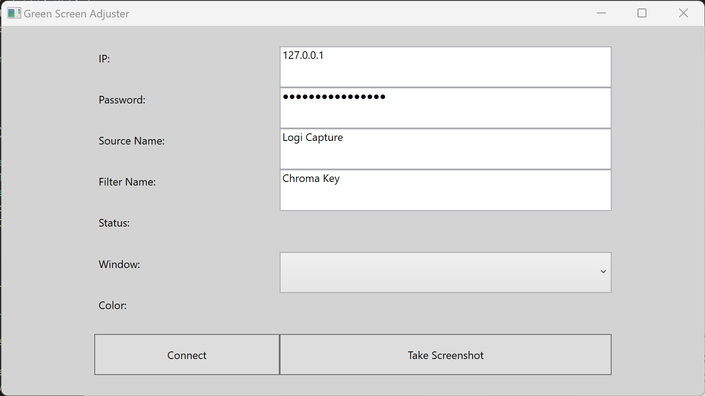

# GreenScreenAdjuster

A WPF app to automate the Chroma Key filter settings in OBS.

## Problem Statement

I am a Twitch streamer who uses [OBS](https://github.com/obsproject/obs-studio) to broadcast my stream.
I utilize a green screen and I use the Chroma Key filter in OBS to remove the green background. Many
streamers understand that good, consistent lighting is an important part of setting up a green screen
successfully, to ensure that the shade of green remains consistent. This often involves placing a ring
light in front of your face. However, I do not like staring into bright lights for hours at a time,
and strongly prefer natural light. So I stream from a room with large windows to take advantage of
the natural sunlight.

The problem with this is that the sun does not provide consistent lighting, and as a result the
specific shade of green (as perceived by my webcam) has the potential of changing each time I start
a new stream, and often during a single stream. And when the shade of green changes, it is necessary
to manually update the Chroma Key filter in OBS.

## What this app does

This app solves the problem through a simple automation. You need to configure this app to
select a specific Camera Source and Chroma Key filter name, as well as a window to capture.
Then you draw a rectangle overlay over the selected window to designate a specific area to
capture as a screenshot. The app then starts a timer and periodically takes a screenshot
of the selected area, computes the average color brush, and updates OBS via Websockets to
set the Chroma Key filter color automatically. This app does not change the other parameters
of the filter (such as similarity, smoothness, key color spill reduction, etc.).



## How to use it

Enter the IP of your OBS instance; this will almost always be `127.0.0.1`. Also enter your
OBS password (this can be found under Tools > WebSocket Server Settings, and then click
'Show Connect Info'). Type in the name of your Video Capture device, and also type in the
name of your Chroma Key filter (it will commonly be named Chroma Key). Choose a running
window to capture which contains the video output of your webcam, and note that this
should not be OBS itself. Then press 'Take Screenshot,' and when the grey overlay appears,
use your mouse to click and drag a rectangular region that includes only a green section
of your green screen. It is critically important that this contains ONLY green (and will
continue to contain only green throughout the entire duration of your stream). If you have
done this successfully, the average color will display in the window and will be green.
Finally, click the Connect button to connect it to OBS.

## Limitations

I am currently using a Logitech webcam, which utilizes the Logi Capture application.
In other words, I do not directly bring the webcam into OBS, but rather I bring the
Logi Capture application in as my Video Capture device. This means you can see the
webcam in the separate Logi Capture application without any filters applied, and
that is what allows this program to function successfully. If you are using another
kind of webcam or otherwise are bringing your webcam directly into OBS without an
intermediate program like Logi Capture, this application will not work well. The
reason is because the video will show up in OBS with filters already applied, and
thus you will not be able to screen capture the original green colors.

## Contributing

Not sure if you need to do this or if it's automatic, but I ran the following
commands to exclude the default system properties from further changes:

```bash
git update-index --skip-worktree GreenScreenAdjuster/App.config
git update-index --skip-worktree GreenScreenAdjuster/Properties/Settings.Designer.cs
git update-index --skip-worktree GreenScreenAdjuster/Properties/Settings.settings
```

The reason for this is because the application saves your OBS connect password to
its own properties, and you really don't want to check that into the VCS.
